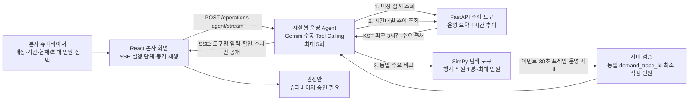
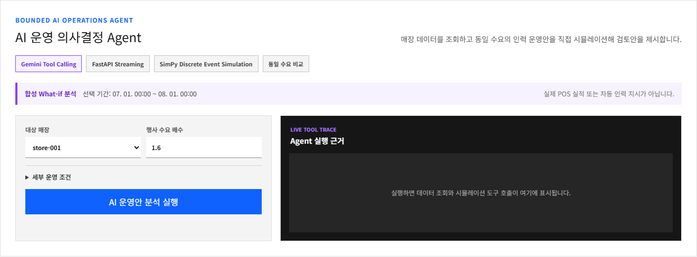
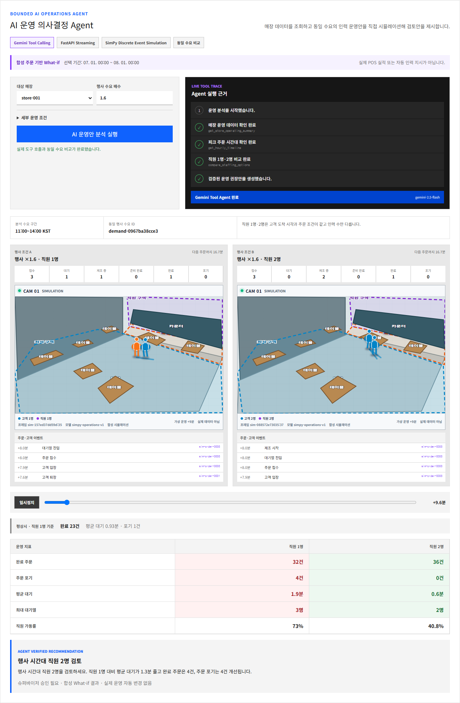

# AI 운영 의사결정 Agent 구현·검증 증적

## 심사 시 한 문장 설명

본사 Agent가 선택 기간의 매장 데이터와 시간대별 주문 추이를 조회하고, 같은 고객 수요로 직원 1명부터 투입 가능 최대 인원까지 SimPy 탐색을 실행한 뒤 운영 목표를 만족하는 최소 인원을 슈퍼바이저 검토안으로 제시한다.

## 데이터 흐름



- Gemini는 도구 선택과 설명 순서만 담당한다.
- 주문 수요 생성, 이산사건 진행, 지표 계산, 권장 수치 검증은 코드가 담당한다.
- Gemini 실패 시 `규칙 기반 대체 분석`으로 표시하고 동일한 세 도구 순서를 코드가 완료한다.
- What-if 결과는 DB에 저장하지 않으며 실제 POS 실적이나 자동 인력 지시로 표시하지 않는다.
- 적정 기준은 평균 대기 5분 이하, 주문 포기율 5% 이하, 직원 가동률 90% 이하이며 세 기준을 모두 만족하는 최소 인원을 선택한다.
- 최대 인원까지 기준을 만족하지 못하면 임의의 적정 인원을 만들지 않고 `최대 인원으로도 목표 미달`로 표시한다.

## 로컬 실제 실행 결과

- 실행 일시: 2026-08-10 KST
- 선택 기간: 2026-07-01 00:00 ~ 2026-08-01 00:00 KST
- Agent 실행 출처: `gemini_tool_agent` (`gemini-2.5-flash`)
- 입력 주문 출처 표시: `합성 주문 기반 What-if`
- 실제 도구 호출: 운영 요약 조회 → 1시간 주문 추이 조회 → 동일 수요 직원 비교
- 동일 수요 ID: `demand-0967ba38cce3`
- 로컬 실행 예시: 직원 1명 완료 32건·포기 4건·평균 대기 1.9분, 직원 2명 완료 36건·포기 0건·평균 대기 0.6분
- 검증 권장안: 행사 시간대 직원 2명 검토, 슈퍼바이저 승인 필요

실행 전 화면:



도구 호출·동일 수요 비교·동시 디지털 트윈 결과:



## 핵심 API 증적

### 운영 비교

`POST /api/simulations/operations/compare`

```json
{
  "store_id": "store-001",
  "duration_minutes": 180,
  "arrival_profile": [
    {"start_minute": 0, "end_minute": 60, "arrivals_per_hour": 19.2},
    {"start_minute": 60, "end_minute": 120, "arrivals_per_hour": 30},
    {"start_minute": 120, "end_minute": 180, "arrivals_per_hour": 24}
  ],
  "event_multiplier": 1.6,
  "current_staff_count": 1,
  "max_staff_count": 6,
  "seed": 20260730
}
```

응답에는 `staffing_options`, `recommended_staff_count`, `capacity_sufficient`, `staffing_targets`와 현재·최대·권장 재생 결과가 포함된다. 모든 인원 조건은 같은 `event_demand_trace_id`와 주문 ID·도착 시각·고객 속성을 공유한다.

### Agent 스트림

`POST /operations-agent/stream`

SSE 이벤트 순서:

```text
run_started
tool_started / tool_completed: get_store_operating_summary
tool_started / tool_completed: get_hourly_timeline
tool_started / tool_completed: compare_staffing_options
recommendation_ready
run_completed
```

내부 사고 과정은 보내지 않고 도구 이름, 진행 상태, 확인된 수치와 최종 검증 결과만 전송한다.

## 테스트 항목

- 동일 요청·seed의 수요, 이벤트, 지표 재현성
- 직원 1명부터 최대 인원까지 주문 ID, 도착 시각, 고객 속성, 수요 trace 동일성
- 목표를 만족하는 최소 인원 선택과 최대 인원 목표 미달 판정
- 마지막 시간 구간까지 주문 생성 및 주문 상태 합계 정합성
- 기존 단일 시뮬레이션 응답 하위 호환성
- KST 피크 3시간 선택과 주문 데이터 없음 기본 수요 대체
- Gemini 도구 선택, 최대 5회 제한, Gemini 실패 규칙 기반 대체
- SSE 분할 청크 파싱, 좌우 공통 시각 프레임 탐색, 다음 주문 표시
- Python 전체 테스트 및 Dashboard test·lint·build
